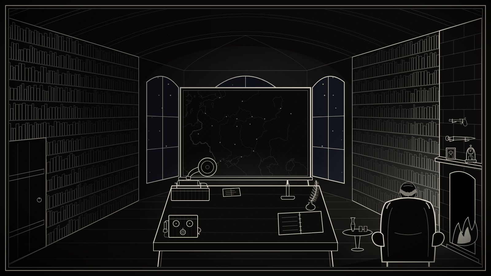

::: {.callout-note appearance="simple"}
**[→ Play it on itch.io](https://phron1mos.itch.io/the-seraphim-letters)**
:::

December, 1879, St. Petersburg. You are an investigator for the Third Section of His Imperial Majesty's Own Chancellery (known as the Department), tasked with exposing a religious conspiracy plotting the Tsar's assassination. While the Seraphim are a fictitious group, the game incorporates real history and describes a plausible scenario (Alexander II was in fact assassinated in 1881 by a radical conspiracy, after numerous other attempts).

The Department intercepts letters and has provided a library for you to work from, but the rest is up to you. That means reading carefully through those letters, often cracking ciphers first, and digging up old newspapers and classic literature from the archives. I wanted The Seraphim Letters to evoke the feeling of reading a classic Russian novel, which led to the black/white woodcut aesthetic and period music, but also (fair warning) tangled family trees and long names. All part of the fun!

While I came up with the concept and narrative, I was curious whether Claude Fable was capable of coding it up for me. Ultimately, it was, though it took a lot more prompting and revision than I had anticipated. According to Claude, The Seraphim Letters uses Plain HTML, CSS and JavaScript — no framework and no build step. The library, the map and the documents are all drawn as generated SVG, the type is self-hosted, and the score is public-domain Bach, Beethoven, Chopin and Mussorgsky. It ships as static files.
