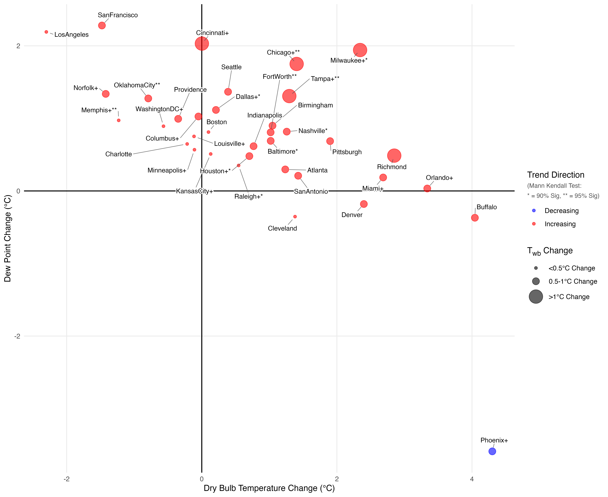
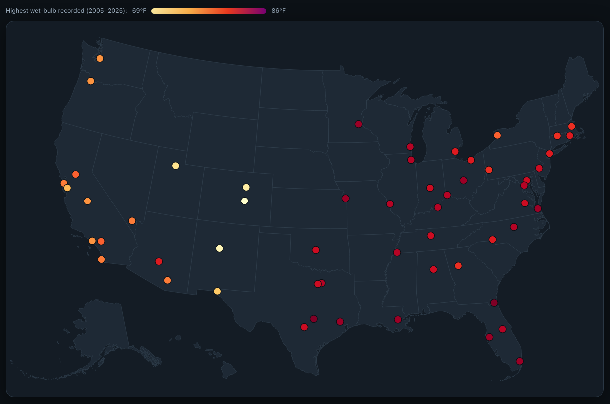

This summer I worked with the Georgia Tech Urban Climate Lab on researching trends in urban wet-bulb temperatures over the past two decades, contributing to "Expanding national policies for humid heat events exceeding the limits of human tolerance", currently under review in the journal *Nature Climate Change*. For this project, I pulled two decades of hourly NOAA NCEI Local Climatological Data, 2005 through 2025, one primary airport station per city. Next, I extracted
each city's hottest wet-bulb hour of every year, along with the dry-bulb temperature, relative humidity and dew point that accompanied it, and combined it all into a single, clean table. I was then tasked with generating this figure, which incorporates no less than six variables into a single, legible graphic.

I also gave the data to Claude and asked it to generate an website with an interactive map and context explanation. After a few rounds of tuning, I was highly impressed with the result. I certainly wish Claude Code had been around when I was building this website!

::: {.callout-note appearance="simple"}
**[→ Open the interactive map](https://wstone0.github.io/us-wet-bulb/)** · [source on GitHub](https://github.com/wstone0/us-wet-bulb)
:::

